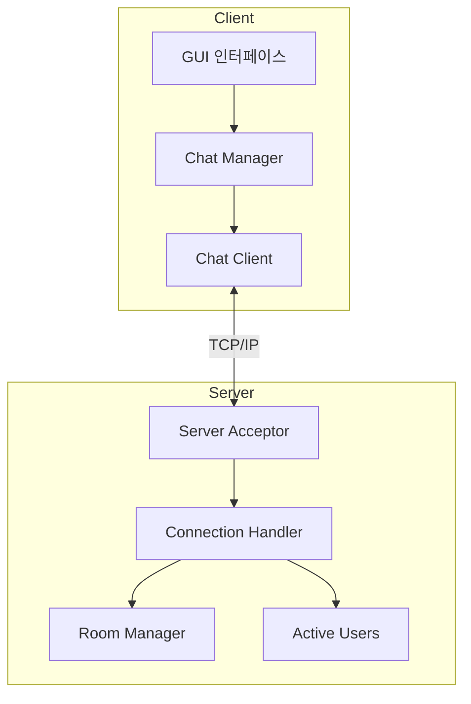
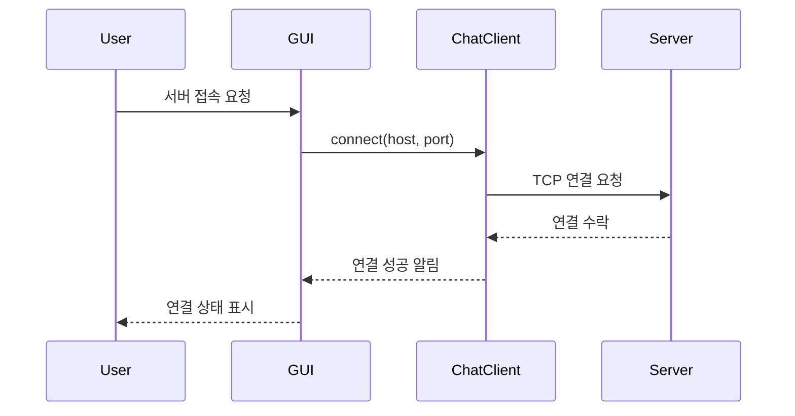
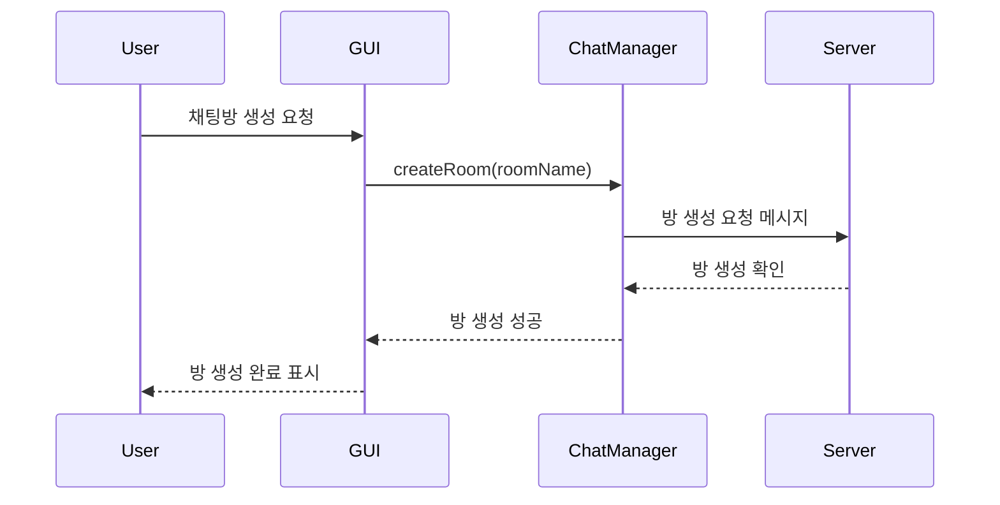
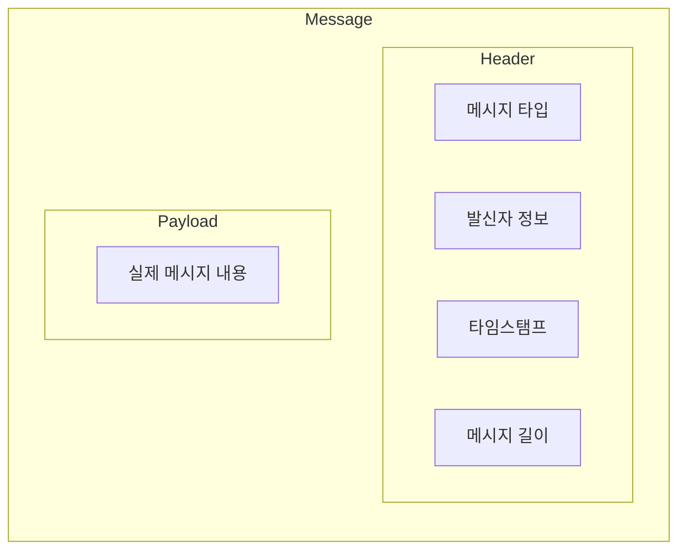

# Lanssenger 프로그램 구조

## 1. 전체 시스템 구조

## 2. 주요 기능 동작 과정

### 2.1 서버 연결 과정

### 2.2 채팅방 생성 및 참여

## 3. 주요 컴포넌트 설명

### 3.1 클라이언트 컴포넌트

- **GUI (그래픽 유저 인터페이스)**

  - `MainWindow`: 메인 창 관리
  - `CreateRoom`: 채팅방 생성 인터페이스
  - `GroupChatWindow`: 그룹 채팅 창 관리
  - `UserListWindow`: 사용자 목록 표시

- **ChatClient**

  - 서버와의 TCP 연결 관리
  - 메시지 송수신 처리
  - 비동기 통신 처리

- **ChatManager**
  - 채팅방 상태 관리
  - 메시지 라우팅
  - 사용자 세션 관리

### 3.2 서버 컴포넌트

- **Server**

  - 클라이언트 연결 수락
  - 클라이언트 세션 관리
  - 메시지 브로드캐스팅

- **ActiveUsers**
  - 접속 중인 사용자 관리
  - 사용자 상태 업데이트
  - 사용자 목록 동기화

## 4. 통신 프로토콜

클라이언트와 서버는 TCP/IP 프로토콜을 사용하여 통신하며, 다음과 같은 기본 작업을 수행합니다:

1. 연결 설정
2. 메시지 전송
3. 채팅방 관리
4. 사용자 상태 관리
5. 연결 종료

### 4.1 메시지 구조

각 메시지는 헤더와 페이로드로 구성되어 있으며, 이는 다음과 같은 의미를 가집니다:

- **헤더 (Header)**

  - 메시지의 메타데이터를 포함
  - 메시지 유형 (TEXT, SYSTEM, ERROR)
  - 발신자 정보
  - 타임스탬프
  - 메시지 길이 정보

- **페이로드 (Payload)**
  - 실제 전송하고자 하는 데이터 내용
  - 채팅 메시지 텍스트
  - 시스템 명령어
  - 에러 메시지

이러한 구조를 사용하는 이유:

1. **메시지 경계 구분**: 헤더에 메시지 길이 정보가 있어 여러 메시지가 연속으로 전송되어도 정확히 구분 가능
2. **메시지 무결성**: 메시지가 완전히 전송되었는지 확인 가능
3. **메시지 타입 구분**: 일반 채팅, 시스템 메시지, 에러 등을 구분하여 처리 가능
4. **효율적인 라우팅**: 헤더 정보를 통해 메시지를 적절한 처리기로 전달 가능

