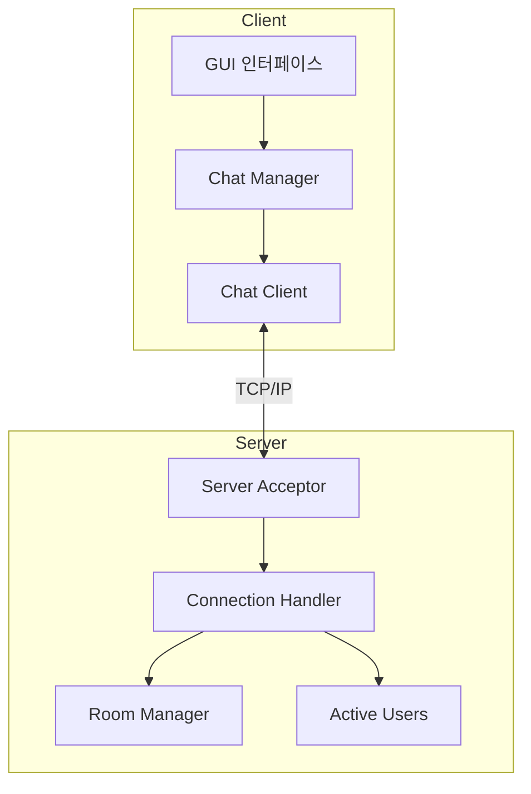
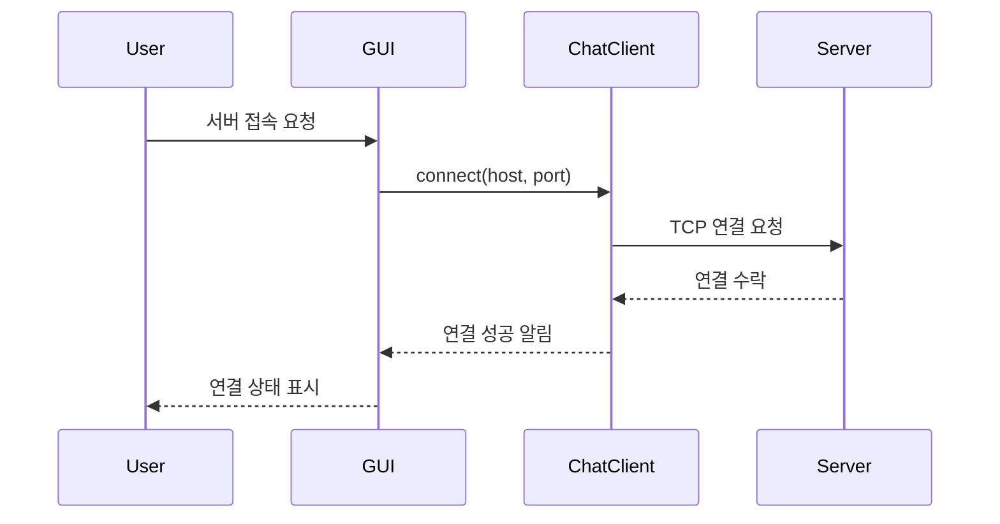
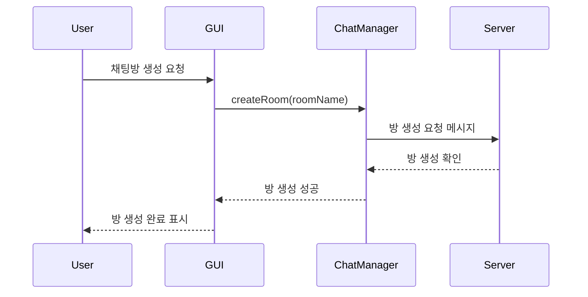

# 📌 LANssenger

## 👥 Contributors

- [**전태현**](https://github.com/taehyunjeon0203)
- [**유병연**](https://github.com/youbyeongyeon)
- [**이유경**](https://github.com/dldbrud)

## 🎯 주제

- LAN 대역에서 사용 가능한 네트워크 메신저

### 🛠 세부기능

- 기본 틀
  - 같은 네트워크 (ex: eduroam || KNU WIFI 6) 연결된 사용자들끼리 채팅 가능
- 세부 기능
  - 최초 접속시 닉네임 생성
  - 전체 채팅방 및 개별 채팅방 생성 기능
  - 방 이름을 정한 후 방을 생성하면 6자리 숫자가 할당, 원한다면 4자리 비밀번호 설정 가능
  - 방 설정: 방 이름 변경 및 나가기, 접속중인 사용자 초대, 채팅 차단
  - 현재 활동중인 인원 표시
  - 닉네임 형식(태현.xxx) <- .xxx == ip의 일부(지정 불가능)

## 📁 프로젝트 구조

```
lanssenger/
├── include/
│   ├── client/
│   │   ├── gui/           # GUI 관련 헤더
│   │   ├── chat_client.hpp
│   │   ├── chat_manager.hpp
│   │   ├── chat_message.hpp
│   │   └── nickname_manager.hpp
│   ├── server/
│   └── common/
├── src/
│   ├── client/
│   │   ├── gui/           # GUI 관련 소스
│   │   ├── chat_client.cpp
│   │   ├── chat_manager.cpp
│   │   ├── chat_message.cpp
│   │   └── nickname_manager.cpp
│   ├── server/
│   └── common/
└── scripts/               # 빌드 스크립트
```

## 🛠 빌드 방법

### 요구사항

- CMake 3.10 이상
- Qt6
- Boost
- C++17 지원 컴파일러

### 빌드

1. 클라이언트 빌드:

```bash
./scripts/build_client.sh  # Linux/macOS
scripts/build_client.bat   # Windows
```

---

# Lanssenger 프로그램 구조

## 1. 전체 시스템 구조



## 2. 주요 기능 동작 과정

### 2.1 서버 연결 과정



### 2.2 채팅방 생성 및 참여



## 3. 주요 컴포넌트 설명

### 3.1 클라이언트 컴포넌트

- **GUI (그래픽 유저 인터페이스)**

  - `MainWindow`: 메인 창 관리
  - `CreateRoom`: 채팅방 생성 인터페이스
  - `GroupChatWindow`: 그룹 채팅 창 관리
  - `UserListWindow`: 사용자 목록 표시

- **ChatClient**

  - 서버와의 TCP 연결 관리
  - 메시지 송수신 처리
  - 비동기 통신 처리

- **ChatManager**
  - 채팅방 상태 관리
  - 메시지 라우팅
  - 사용자 세션 관리

### 3.2 서버 컴포넌트

- **Server**

  - 클라이언트 연결 수락
  - 클라이언트 세션 관리
  - 메시지 브로드캐스팅

- **ActiveUsers**
  - 접속 중인 사용자 관리
  - 사용자 상태 업데이트
  - 사용자 목록 동기화

## 4. 통신 프로토콜

클라이언트와 서버는 TCP/IP 프로토콜을 사용하여 통신하며, 다음과 같은 기본 작업을 수행합니다:

1. 연결 설정
2. 메시지 전송
3. 채팅방 관리
4. 사용자 상태 관리
5. 연결 종료

각 메시지는 헤더와 페이로드로 구성되어 있으며, 안정적인 데이터 전송을 보장합니다.
